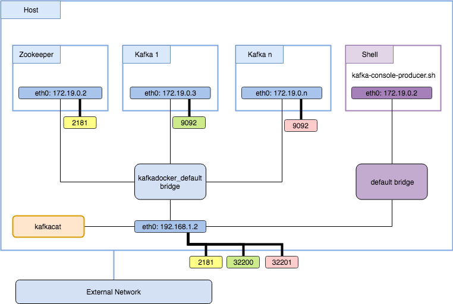

# Apache Kafka/Zookeeper Installation

> ## *Step-By-Step guide for Apache Kafka*
>
> *Kafka version: 2.12-2.2.0*

---

## Docker Commmand Line

```bash

# Note: Apache Kafka requires having Zookeeper server running
docker run -it -h kafka --name kafka-node --cpus=1 \
--memory="1024MB" --memory-swap="2048MB" \
--net=hadoop-cluster --ip="192.168.0.101" \
--add-host="master:192.168.0.1" \
--add-host="slave-1:192.168.0.2" \
--add-host="slave-2:192.168.0.3" \
--add-host="slave-3:192.168.0.4" \
--add-host="ambari:192.168.0.100" \
-p 2181:2181 -p 9092:9092 -p 9093:9093 -p 9094:9094 \
--workdir="/" \
-v /var/log/kafka:/opt/kafka_2.12-2.2.0 \
debian:hadoop-kafka

# Ports reference:
# -----------------
# Zookeeper (Client Port): 2181
# Kafka: 9092-9094

```

## Environment Variables Setup / Entrypoint *(/start-kafka.sh*)

```bash

#!/bin/bash
export JAVA_HOME=/opt/jdk1.8.0_201

export KAFKA_HOME=/opt/kafka_2.12-2.2.0
export KAFKA_CONF_DIR=$KAFKA_HOME/config
export KAFKA_LOGS=$KAFKA_HOME/logs
export ZOOKEEPER_HOME=$KAFKA_HOME
export KAFKA_ADVERTISED_LISTENERS=PLAINTEXT://localhost:9092
export KAFKA_LISTENERS=PLAINTEXT://0.0.0.0:9092
export KAFKA_ZOOKEEPER_CONNECT=localhost:2181

export PATH=:$PATH:$JAVA_HOME/bin:$KAFKA_HOME/bin

zookeeper-server-stop.sh && \
kafka-server-stop.sh

zookeeper-server-start.sh -daemon $KAFKA_CONF_DIR/zookeeper.properties && \
kafka-server-start.sh -daemon $KAFKA_CONF_DIR/server.properties

tail -f $KAFKA_LOGS/server.log


```

## Kafka Networking



## Launch Kafka & Zookeeper

```bash

zookeeper-server-start.sh -daemon $KAFKA_CONF_DIR/zookeeper.properties && \
kafka-server-start.sh -daemon $KAFKA_CONF_DIR/server.properties

```

## Kafka Demo Video

[Kafka Demo](./images/kafka-demo-video.webm)

## Apache Kafka Documentation

### *Apache Kafka: Quick Start*

- [Apache Kafka: Quick Start](https://kafka.apache.org/quickstart)

### *Apache Kafka: Networking*

- [Apache Kafka: Connectivity](https://github.com/wurstmeister/kafka-docker/wiki/Connectivity)